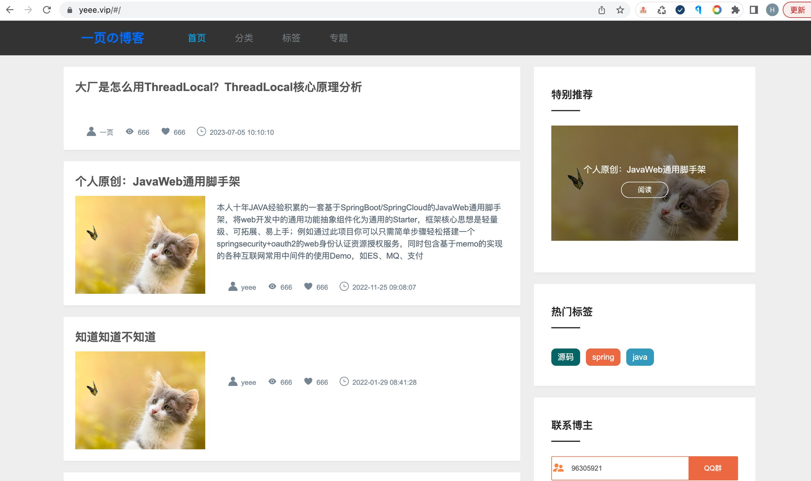
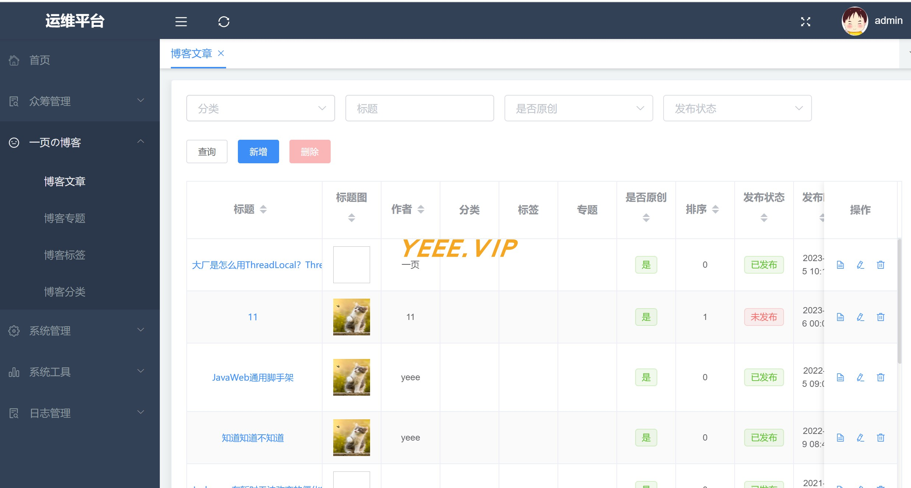
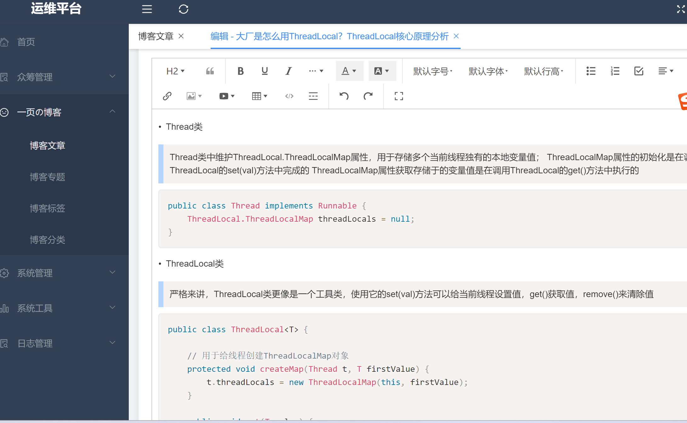
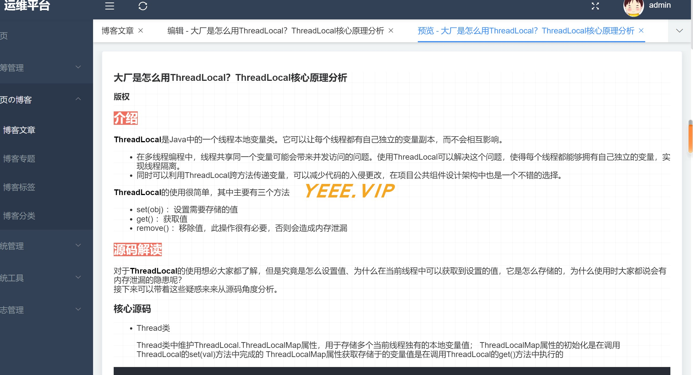

## 系统说明

- 基于 Spring Boot + Vue 开发的 **轻量级博客系统**
- 轻量级 + 组件化 + 可扩展

## 程序预览

[预览地址](https://www.yeee.vip)

### 前台



### 后台

- 博客管理



- 博客编辑



- 博客预览



## 快速开始

### 核心依赖

| 依赖                          | 版本                                                   |
|-----------------------------|------------------------------------------------------|
| Spring Boot                 | 2.6.3                                                |
| yeee-memo                   | [通用web脚手架](https://gitee.com/yeeevip/yeee-memo.git) |

### 模块说明

```lua
yeee-blog
├── app-h5
    ├── yeee-admin-ui -- 博客后台管理系统｜vue
    └── yeee-blog-web -- 博客客户端｜vue
├── doc -- 文档脚本
├── yeee-blog-bootstrap -- 主启动工程
├── yeee-blog-client -- 博客客户端服务
├── yeee-app-common -- 公共模块
├── yeee-blog-manage -- 博客管理端服务
├── yeee-sys-manage -- 系统权限管理服务
```

### 本地开发 运行

#### 环境要求

- jdk1.8
- mysql >= 5.7
- redis
- maven >= 3.6
- node.js >= 18

- 需要远程安装配置请联系，作者QQ：394230080

```
# 下载yeee-memo工程
git clone https://gitee.com/yeeevip/yeee-memo.git

# 打包[JavaWeb通用脚手架]
cd yeee-memo/memo-parent 
mvn clean install

# 下载yeee-blog项目
git clone https://gitee.com/yeeevip/yeee-blog.git

# 导入数据库
创建数据库yeee_blog，依次导入doc/sql目录下yeeee_manage.sql yeeee_blog.sql

# 编译运行博客服务
cd yeee-blog 
mvn clean install
java -jar yeee-blog-bootstrap/target/yeee-blog-bootstrap-1.0.0-SNAPSHOT.jar

# 运行博客管理端ui
cd yeee-blog/app-h5/yeee-admin-ui 
npm install --registry=https://registry.npmmirror.com 
npm run dev

- 管理员账号密码：admin/111111

# 运行博客用户端ui
cd yeee-blog/app-h5/yeee-blog-web 
npm install 
npm run dev
```
- 使用idea运行步骤视频

| 公众号回复：yeee-blog                                      |     
|------------------------------------------|
|   |  


## 交流群

- 作者QQ：394230080
- 招有经验尽量会全栈的技术，有意向的可以来我们**接单群**

| 微信群                                      | QQ群                                                                                 | 技术接单群                                                                           |
|------------------------------------------|-------------------------------------------------------------------------------------|-----------------------------------------------------------------------------------|
|   |                                                | 
| 回复：加群，邀您加入群聊                   | <a href="https://qm.qq.com/q/oLSCm1Ksjm" target="_blank">点击加入QQ群：96305921</a>  |java、vue、微信小程序接单

